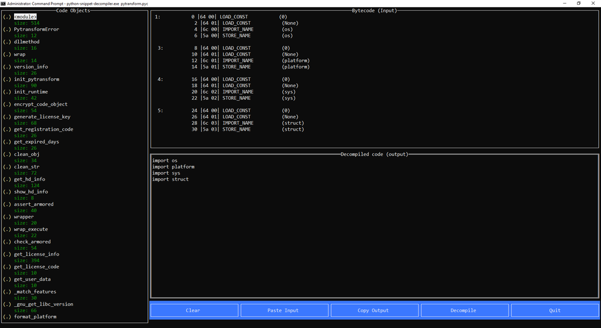

# Python Snippet Decompiler

Modern versions of Python (> 3.7) are relatively harder to decompile. The decompilers which are currently available (viz [pycdc](https://github.com/zrax/pycdc), [uncompyle6](https://github.com/rocky/python-uncompyle6/), [decompile3](https://github.com/rocky/python-decompile3)) frequently error out when decompiling a .pyc from these versions. Hence often it is needed to manually decompile Python bytecode by hand. Manual decompilation takes a lot of time and as a result this tool was built to assist during the process.

Python Snippet Decompiler is a tool to assist during manual decompilation of Python bytecode. The idea is to input small snippets of bytecode instructions which the tool attempts to decompile with pycdc. The instruction provided as input should be free from any control flow instruction. Control flow should be manually handled anyway.

## Usage

Precompiled binaries for Windows are provided in releases. Grab the latest build and run

```
python-snippet-decompiler <file.pyc>
```

The tool is a terminal based TUI app with mouse support. Click on the "Paste Input" button to paste the instructions from clipboard. The instructions can be obtained using 

```
pydisasm -F bytes <file.pyc>
```

pydisasm is a part of the `xdis` package and can be installed as `pip install xdis`.

Before clicking decompile, ensure the correct code object is selected on the left code objects listing.

Click on "Copy output" to copy the decompiled output to the clipboard.

## Screenshot



## License

MIT